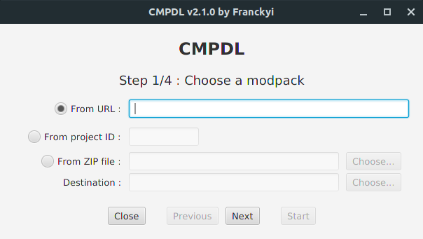
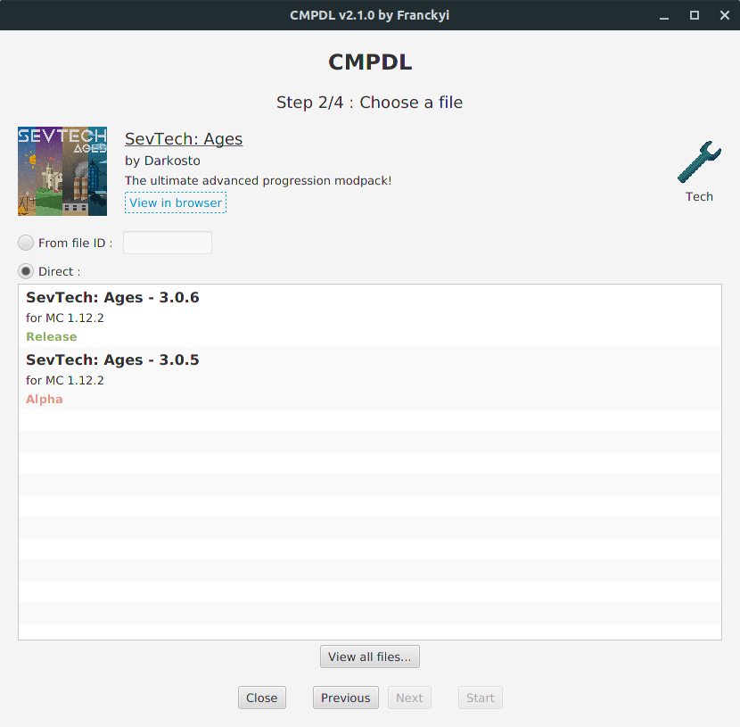
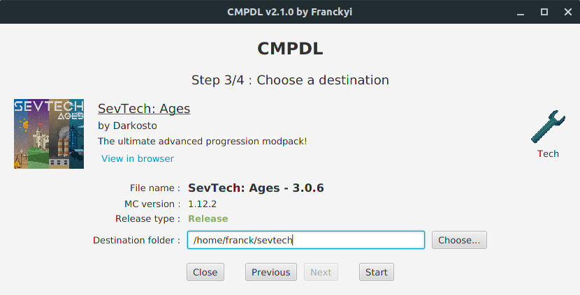
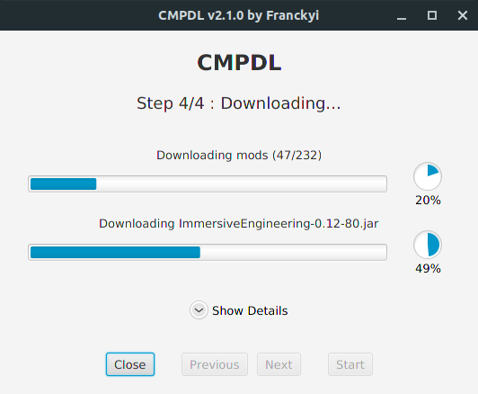

# CMPDL (Curse Modpack Downloader)
### A lightweight alternative to Twitch App for downloading Minecraft modpacks.

---
## [Downloads](https://github.com/Franckyi/CMPDL/releases)
CMPDL is a Java application created by Franckyi, based on [Vazkii's project](https://github.com/Vazkii/CMPDL). It allows you to download your favorite modpacks from websites like [CurseForge](https://minecraft.curseforge.com/modpacks) or [Feed the Beast](https://www.feed-the-beast.com/modpacks). For users who don't like the Twitch App and still want to enjoy Minecraft modpacks, this app is made for you !

This project is under the [MIT License](LICENSE).

### As this project is based on the JavaFX framework, Linux and MacOS system users must install OpenJFX or Oracle's JRE to start the application.

What changed between Vazkii's version and my version ?

- A revamped user interface
- Support for [www.curseforge.com](http://www.curseforge.com) website
- The user can choose the destination path

## How to use ?

- Follow the steps from step 1 to step 3.
- Press "Start" and wait until it finishes.
- Forge won't be installed. The recommended Forge version to install will be shown in the log. You can also install a newer version, but if it breaks, go back to the recommended version.

## Screenshots

